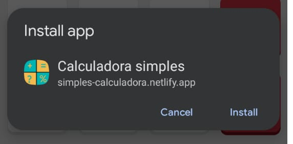
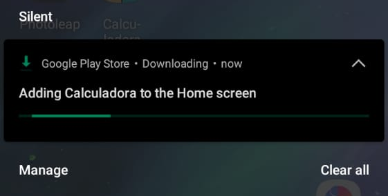
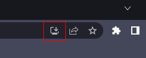

# Calculadora simples #

`⚠️ Ainta em desenvolvimento ⚠️`
O meu objetivo principal com essa calculadora, é substituir a calculadora padrão do Android e do Windows, entregando todas as funcionalidades dessas calcuadoras e mais um pouco.

Esse projeto é uma PWA, ou seja, uma aplicação web que pode ser instalada no dispositivo e rodar sem conexão com internet.

## Indice ##
- [Como instalar ⬇️](https://github.com/andrewhermelino/calculadora-simples/edit/master/README.md#como-instalar-%EF%B8%8F)
    - [Pelo navegador no celular 📱](https://github.com/andrewhermelino/calculadora-simples/edit/master/README.md#--pelo-navegador-no-celular-)
    - [Pelo navegador no computador 🖥️](https://github.com/andrewhermelino/calculadora-simples/edit/master/README.md#--pelo-navegador-no-computador-%EF%B8%8F)
- [Tecnologias utilizadas no desenvolvimento ✔️](https://github.com/andrewhermelino/calculadora-simples/edit/master/README.md#tecnologias-utilizadas-no-desenvolvimento-%EF%B8%8F)
- [Metas 🎯](https://github.com/andrewhermelino/calculadora-simples/edit/master/README.md#metas-)
    - [Para o lançamento 🥳](https://github.com/andrewhermelino/calculadora-simples/edit/master/README.md#--para-o-lan%C3%A7amento-)
    - [Calculadoras 🔢](https://github.com/andrewhermelino/calculadora-simples/edit/master/README.md#--calculadoras-)
    - [Atualizações extras 🚧](https://github.com/andrewhermelino/calculadora-simples/edit/master/README.md#atualiza%C3%A7%C3%B5es-extras-)

## Como instalar ⬇️ ##
Além de utilizar essa calculadora apenas pelo navegador, é possível também instalar no seu dispositivo e adicionar um ícona na área de trabalho

### - Pelo navegador no celular 📱 ###
- Acesse o site da calculadora: https://simples-calculadora.netlify.app/

- Abra o menu do seu navegador 

    
    
- Clique em `Instalar aplicativo` para instalar a calculadora

    
    
- Clique em instalar

    
    
- Aguarde enquanto o aplicativo é instalado

    
    
- O ícone da calculadora aparecerá no seu celular

    
    

### - Pelo navegador no computador 🖥️ ###
- Acesse o site da calculadora: https://simples-calculadora.netlify.app/

- Clique no para instalar `Calculadora simples`

    
    
- Clique em `INSTALAR` para instalar a calculadora

    
    
- Agora a calculadora estará disponível no menu iniciar do seu computador

    

## Tecnologias utilizadas no desenvolvimento ✔️ ##
- [React ⚛️](https://pt-br.reactjs.org/)
- [Typescript](https://www.typescriptlang.org/)
- [Netlify](https://www.netlify.com/)

## Metas 🎯 ##
Implementações que eu quero adicionar na calculadora.

### - Para o lançamento 🥳 ###
Implementações que eu julgo importantes para o aplicativo antes de considerar finalizado, apesar de que mais atualizações ainda virão.
- [ ] Implementações no teclado principal `✏️ 3/5`
    - [x] ~~Operações básicas (adição, subtração, multiplicação e divisão)~~
    - [x] ~~Comandos para APAGAR, LIMPAR e CALCULAR~~
    - [x] ~~Possibilidade de números decimais~~
    - [ ] Porcentagem
    - [ ] Parenteses
- [ ] Implementações no teclado secundário `✏️ 0/12`
    - [ ] Raiz quadrada
    - [ ] PI
    - [ ] Potência
    - [ ] Fatorial
    - [ ] DEG
    - [ ] Sin
    - [ ] cos
    - [ ] tan
    - [ ] INV
    - [ ] e
    - [ ] In
    - [ ] log
- [ ] Memory
- [ ] Tela `✏️ 0/1`
    - [ ] Adicionar separadores de milhar dinâmicamente
- [ ] Design `✏️ 0/2`
    - [ ] Criar uma logo inicial para o lançamento
    - [ ] Criar um design inicial para o lançamento

### - Calculadoras 🔢 ###
Além da calculadora padrão, terá outros tipos de calculadoras
Baseado nas calculadoras disponíveis no Windows:
- [ ] **Calculadora** `✏️ 0/5`
    - [ ] Padrão
    - [ ] Científica
    - [ ] Representação gráfica
    - [ ] Programador
    - [ ] Cálculo de data
- [ ] **Conversor** `✏️ 0/13`
    - [ ] Moeda
    - [ ] Volume
    - [ ] Comprimento
    - [ ] Peso e massa
    - [ ] Temperatura
    - [ ] Energia
    - [ ] Área
    - [ ] Velocidade
    - [ ] Tempo
    - [ ] Potência
    - [ ] Dados
    - [ ] Pressão
    - [ ] Ângulo

### Atualizações extras 🚧 ###
Algumas implementações que seriam interessantes de adicionar na calculadora em uma atualização futura
- [ ] Design `✏️ 0/4`
    - [ ] Uma logo definitiva
    - [ ] Sistema para escolher entre os temas disponíveis
    - [ ] Sistema para criar próprio tema
    - [ ] Escolher formato dos componentes (Ex: quadrado, 3D, circulado e tabela)
